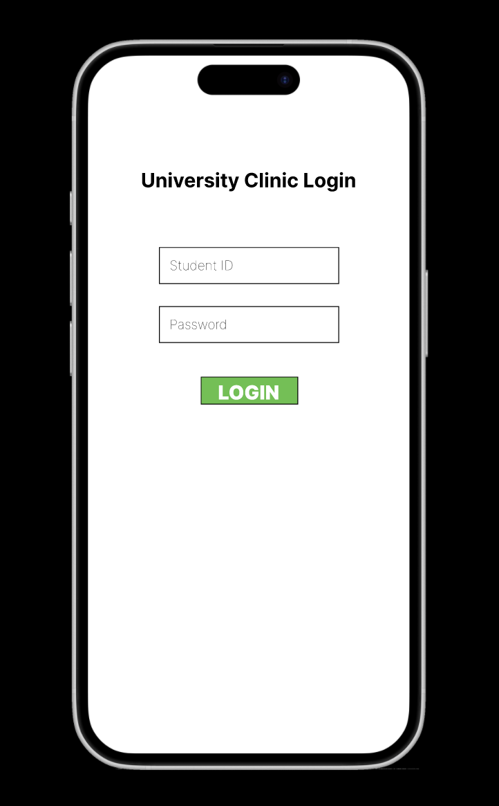
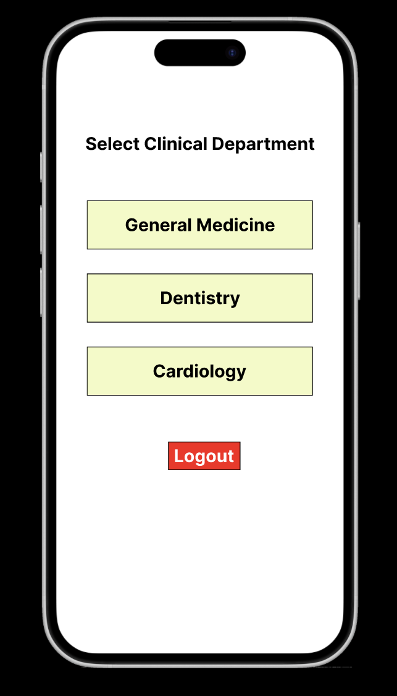
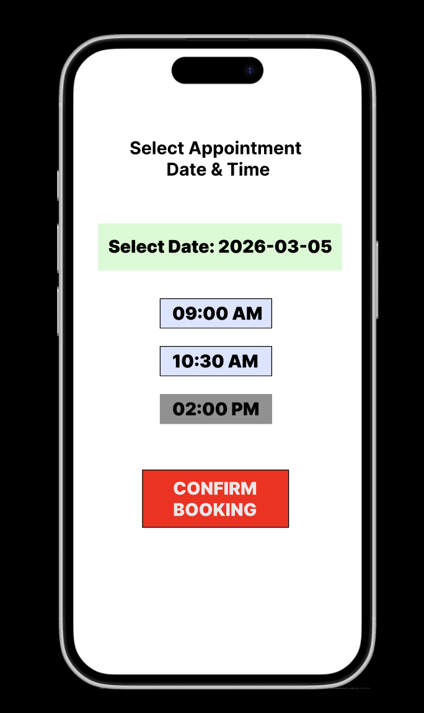
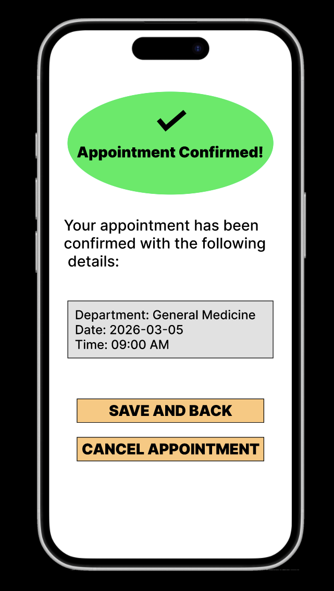

# Test Record - The Prototype

## 1. Introduction
This document records the interaction testing of the Figma prototype. Since this is a prototype, we focus on User Flow Verification and Interaction Logic rather than backend data validation.

## 2. Test Environment
* **Device:** Desktop Web Browser
* **Tool:** Figma
* **Date:** 2026-03-02

## 3. Test Cases & Results

| Test ID | Feature | Action | System Response | Screenshot | Status |
| :--- | :--- | :--- | :--- | :--- | :--- |
| **TC-01** | **User Authentication** | Click "LOGIN"   | System navigates to "Select Clinical Department" (Screen 2). |  | **Pass** |
| **TC-02** | **Dept Selection** | Click "General Medicine"   | System navigates to "Appointment Details" (Screen 3). |  | **Pass** |
| **TC-03** | **Availability Logic** | Observe the "02:00 PM" slot  | Slot is greyed out/disabled, reflecting "Slot Full" logic from Sequence Diagram. |  | **Pass** |
| **TC-04** | **Booking Process** | Click "CONFIRM BOOKING"  | System displays "Appointment Successful!" (Screen 4) with correct summary. |  | **Pass** |
| **TC-05** | **Navigation Loop** | Click "BACK TO DASHBOARD"  | System returns to the Select screen. |  | **Pass** |
| **TC-06** | **Logout** | Click "Logout"  | System returns to the Login screen. |  | **Pass** |

## 4. Conclusion
The prototype successfully demonstrates all core functional paths defined in the Sequence Diagram. All interactive elements respond correctly to user input.
